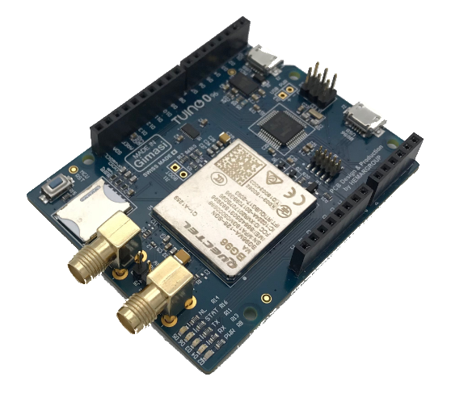
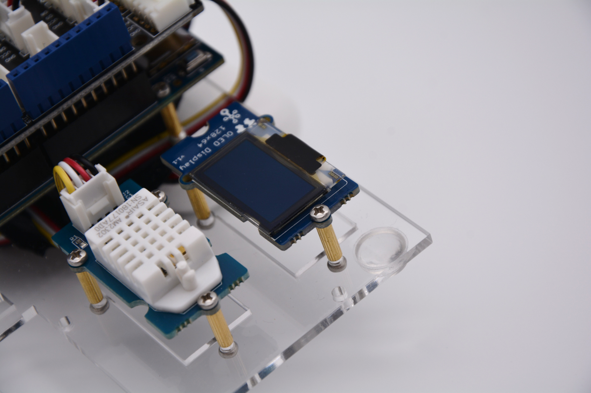
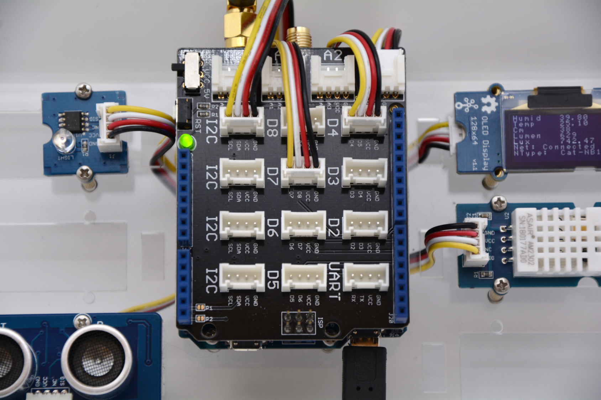
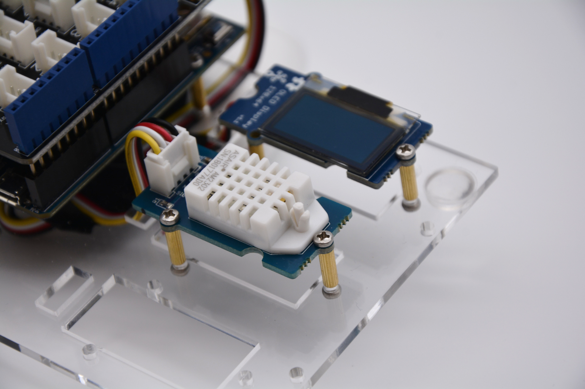
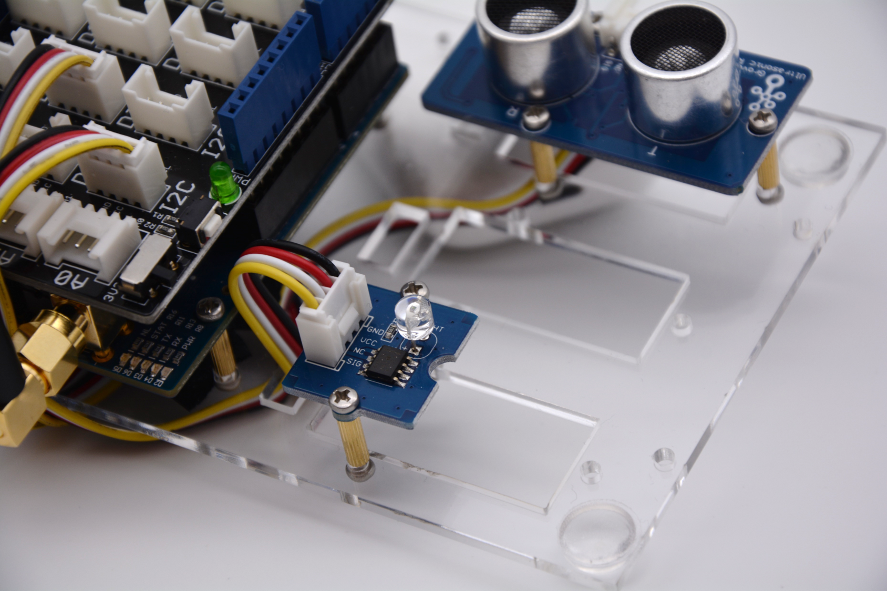
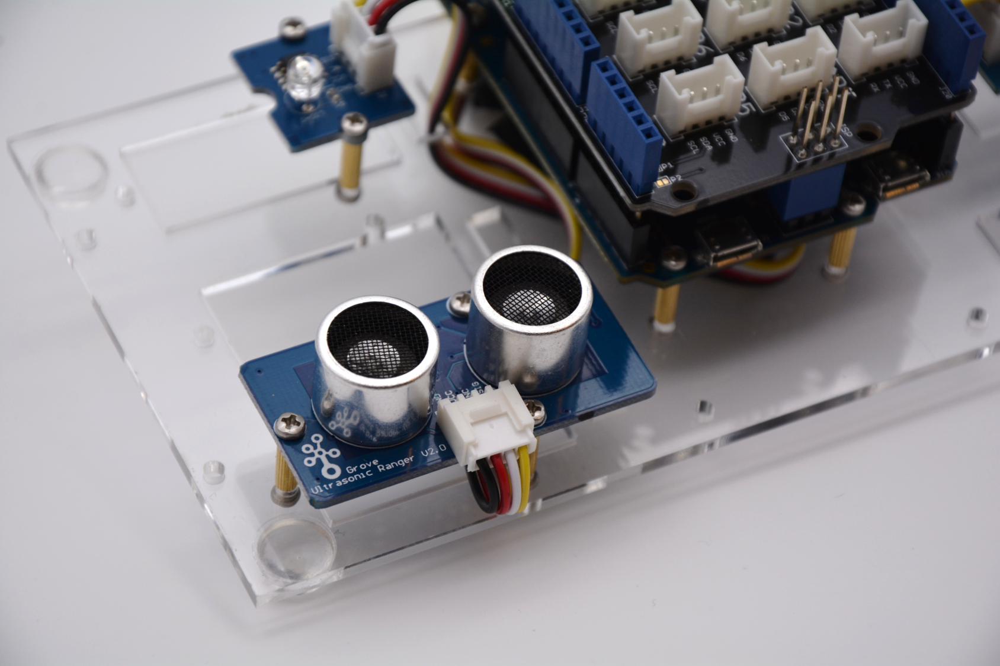
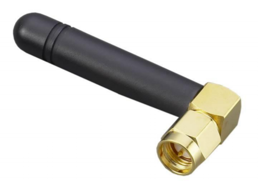
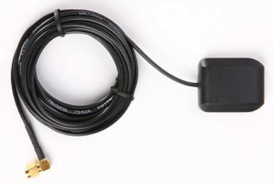

# NB-IoT Demo-Kit Quickstart Guide
The following section provides information about the contents of the mm1 Technology NB-IoT Demo-Kit and guides you through setup and configuration. If you need help getting started or in case you encounter any bugs or
broken links, please contact support@nbiot-solution.de.

## Table of Contents
[1 Contents of the Demo-Kit](#anchor1)  
[2 Getting Started](#anchor2)  
[3 Making changes to the "tuino96nbiotclient" project](#anchor3)  
[4 Flash Device](#anchor4)  
[5 Monitor Output](#anchor5)  
[6 Versioning](#anchor6)  
[7 Authors](#anchor7)  
[8 License](#anchor8)  
[9 Acknowledgments](#anchor9)  

<a name="anchor1"></a>
## 1 Contents of the Demo-Kit

### 1.1. Gimasi Tuino096 Development Board
  

Arduino Zero compatible [board](http://www.gimasi.ch/productions-platforms/tuino096/) fitted with the Quectel [BG96 module](https://www.quectel.com/product/bg96.htm). The main features are listed below.
Get additional information, updates and schematics from [Gimasi](https://github.com/gimasi/TUINO_ZERO_96).  

* **Connectivity:** NB1, CATM1, 2G, GNSS
* **Microcontroller:** ATSAMD21G18, 32-Bit ARM Cortex M0+
* **Operating Voltage:** 3.3 V
* **Digital I/O Pins:** 20
* **PWM Pins:** 3, 4, 5, 6, 8, 9, 10, 11, 12, 13
* **UART:** 2 ( User and for BG96 )
* **Analog Input Pins:** 6, 12-bit ADC channels
* **Analog Output Pins:** 1, 10-bit DAC
* **External Interrupts:** All pins except pin 4
* **DC Current per I/O Pin:** 7 mA
* **Flash Memory:** 256 KB
* **SRAM:** 32 KB
* **LED_BUILTIN:** 13
* **Clock Speed:** 48 MHz
* **Length:** 68 mm
* **Width:** 53 mm

### 1.2. OLED Display 0.96"
  

OLED monochrome 128×64dot matrix display module with Grove 4pin I2C Interface. Works for both 3.3V and 5V supply voltages and can be controlled through the I2C interface on the microcontroller.
Optimized for low power consumption. Get additional information from [Seeed](http://wiki.seeedstudio.com/Grove-OLED_Display_0.96inch/).
* **Interface:** I2C
* **Supply Voltage:** 3.3/5V
* **Display Color:** White

### 1.3. Base Shield
  

Expansion board with multiple Grove connectors to conveniently connect additional sensors. When using the Base Shield with the Tuino096, please make sure the supply voltage switch is turned to the 3.3V position.
Get additional information from [Seeed](http://wiki.seeedstudio.com/Base_Shield_V2/).
 
### 1.4. Temperature and Humidity Sensor
  

High accuracy temperature and humidity sensor to be used in home conditions. Small size, low power and more than 20 meters signal transmission distance.
Get additional information from [Seeed](http://wiki.seeedstudio.com/Grove-Temperature_and_Humidity_Sensor_Pro/).
* **Interface:** Analog ports
* **Supply Voltage:** 3.3/5V
* **Range of Humidity:** 5% - 99% RH
* **Range of Temperature:** -40 – 80 °C
* **Accuracy of Humidity:** ±2% RH
* **Accuracy of Temperature:** ±0.5 °C

### 1.5. Light Sensor
  

Integrates a photo-resistor to detect the intensity of light. Provides an analog output signal. The approximate lux value can be derived by looking at the reference table provided at the Seeed homepage.
Get additional information from [Seeed](http://wiki.seeedstudio.com/Grove-Light_Sensor/).
* **Interface**: Analog port
* **Supply power:** 5V
* **Max lux detected:** 350 lux

### 1.6. Ultrasonic Ranger
  

Non-contact distance measurement module. Issues 8 cycles of 40kHz cycle level and detects the echo. The pulse width of the echo signal is proportional to the measured distance. The trig and echo signal share 1 SIG pin.
Get additional information from [Seeed](http://wiki.seeedstudio.com/Grove-Ultrasonic_Ranger/).
* **Interface:** Digital port
* **Supply Voltage:** 3.3/5V
* **Detecting Range:** 0-4m
* **Resolution:** 1 cm

### 1.7. NB-IoT Antenna (TG.22.0112)
  

790MHz -960 MHz Band8, Band20 NB-IoT Antenna with SMA connector. Needs to be connected to the C3 port on the Tuino096.
Get additional information and return-loss characteristics from [Taoglas](http://www.taoglas.com/wp-content/uploads/2016/04/TG.22.0112.pdf).

### 1.8. GPS-Antenna (APAMP-116)
  

1574.40 ~ 1576.44 MHz GPS antenna with SMA connector. Needs to be connected to the C12 port on the Tuino096.
Get additional information and return-loss characteristics from [Abracon](https://abracon.com/external-antenna/APAMP-116.pdf).

### 1.9. Micro-USB Cable
USB 2.0 cable for synching and charging, high-speed data transmission up to 480 Mbit/s.
Get additional information from [Wentronic](https://www.wentronic.de/en/notebook-and-pc/usb/usb-2.0/8704/easy-usb-sync-and-charging-cable-3-m-black).

### 1.10 SIM
UICC SIM card with NB-IoT connectivity powered by [1NCE](https://1nce.com/).
25 MB of data transferrable via the mm1 Technology NB-IoT Relay-Service over six months.

<a name="anchor2"></a>
## 2 Getting Started

### 2.1. Software setup

#### 2.1.1. Download the Arduino IDE
First, download the Arduino IDE from the [Arduino Website](https://www.arduino.cc/en/Main/Software) and install it. Check the [Getting Started page](https://www.arduino.cc/en/Guide/HomePage) at the Arduino website for
additional installation instructions.

#### 2.2.2. Add your board
Once you have finished the installation, start the IDE, then go to **_'File → Preferences'_** and copy [this link](https://raw.githubusercontent.com/gimasi/TUINO_ZERO_96/master/arduino_ide/package_tuino0_index.json) into the
**_'Additional Boards Manager URLs_'**_ field. Click **_'OK'_** to save your preferences.
\
\
Now go to **_'Tools → Board → Boards Manager...”'_** and type **_'Tuino SAMD'_** into the search bar. Select **_'Tuino SAMD Boards(32-bits ARM Cortex-M0+)'_**, then click onto **_'Install'_** to start the installation.
\
\
Once the installation has finished, go to **_'Tools → Board: … '_** and select the Tuino096 from the bottom of the list. 

#### 2.2.3. Include mandatory libraries
This project depends on the 'ArduinoJson' library to handle objects and arrays. Include the library by navigating to **_'Sketch → Include Library → Manage Libraries'_** and typing **_'ArduinoJson'_** into the search bar.
\
\
_**NOTE:** Make sure to install a stable version and noneof the listed betas. We recommend using version 5.x._

#### 2.2.4. Download the project files
Finally, download the **_'tuino96nbiotclient'_** project from the [mm1 Technology GitHub](https://github.com/mm1technology/demokit-nbiot-tuino096) page by either clicking on **_'clone or download'_** in the upper right corner of your screen and selecting
**_'Download ZIP'_** or [cloning the project](https://docs.gitlab.com/ee/gitlab-basics/command-line-commands.html) using Git and shell commands.

### 2.2. Hardware setup

#### 2.2.1. Connect the antennas
Finally it is time to setup the Gimasi Tuino096!


_**Note:** We recommend that you now attach the Tuino096 board to the plexiglass plate using the provided screws and spacers. However, this is optional and you can do it later on or skip it alltogether._
_**Note:** The Demo-Kit is shipped with the SIM already in place._

* Connect the 790MHz -960 MHz SMA NB-IoT antenna to the SMA connector **C3** next to the LEDs.
* Connect the GPS antenna to the SMA connector **C12** next to the SIM card tray .
* Make sure the two pins between the SMA connectors are bridged with a jumper to supply the GPS antenna with power.

#### 2.2.2. Connect the Sensors
Before you can connect sensors, you need to attach the Base Shield onto the Tuino096 and set the power switch to 3.3V. Once the Base Shield
is attached to the board, attach the sensors as specified below:

| **Sensor / Module** | **Connector** |
| ------ | ------ |
| OLED Screen | I2C |
| Temperatrue & Humidity | D7 |
| Ultrasonic Ranger | D4 |
| Light | A3 |

* **Analog PINS:** A0, A1, A2, A3
* **Digital Pins:** D2, D3, D4, D5, D6, D7, D8

_**Note:** If you want to connect the sensors to other ports than the ones listed above, you will need to make the corresponding changes in the code, which we will get to later on._

#### 2.2.3. Connect the Tuino096
* Plug in the MicroUSB into the port on the Tuino096 and your PC (use the **_'MCU USB'_** port on the Tuino096).
* If you did not do it before, now go to **_'Tools → Board: … '_** and select the Tuino096 from the bottom of the list.

<a name="anchor3"></a>
## 3 Making changes to the "tuino96nbiotclient" project

### 3.1. Select your project template
First select a project template to start off with by choosing between NB-IoT and GSM connectivity. Navigate to the directory that you downloaded earlier (Step 2.2.4.).

* If you want to send data via NB-IoT with GSM Fallback, open the **_'tuino96clientNBIoT'_** folder. 
* If you want to send data via GSM connection only, open the **_'tuino96clientGSM'_** folder.

Each of these folders contains two subfolders.

* If you have little experience with Arduino whatsoever, we recommend you start with the **_'TuinoBG96ClientWithSensors'_** project. Open the corresponding folder.
* If you want to start from scratch or be more flexible, open **_'TuinoBG96ClientBasic'_**.

Now double-click on the **_'.ino'_** file to load it into the Arduino IDE.

### 3.2. Adapting the code
You will need to make a few changes to the code in the **_'.ino'_**. The parameters that you will need to set are explained and listed below. You will find
all code segments that need to be adapted at the beginning of the **'.ino'** file.

_**Note:** Before proceeding, make sure you have selected the Tuino096 Board by checking the port under **'Tools → Port → COM... (Tuino 096)'**._

#### 3.2.1. Set APN 
Comment or uncomment one of the following lines, based on the SIM card and operator you are using for your project (default is 1NCE):

```
/* APN LINK BASED ON YOUR OPERATOR (look into bg96.h)*/
#define OPERATOR_APN    ONCE_APN_LINK
//#define OPERATOR_APN    TELEKOM_APN_LINK
//#define OPERATOR_APN    TELEFONICA_APN_LINK
//#define OPERATOR_APN    VODAFONE_APN_LINK
```

If you are using a different provider than the ones listed in the code, just set it as a string, for example:

```
/* APN LINK BASED ON YOUR OPERATOR (look into bg96.h)*/
#define OPERATOR_APN    "iot.1nce.net"
```

#### 3.2.2. Set operator
Based on your provider, uncomment one of the Operator codes (default is 1NCE):

```
/* OPERATOR CODE BASED ON YOUR OPERATOR (look into bg96.h)*/
#define OPERATOR_CODE   ONCE
//#define OPERATOR_CODE   TELEKOM
//#define OPERATOR_CODE   VODAFONE
//#define OPERATOR_CODE   TELEFONICA
```

If you are using a different provider than the ones listed in the code, just set it as a string(for example):

```
/* OPERATOR CODE BASED ON YOUR OPERATOR (look into bg96.h)*/
#define OPERATOR_CODE   "26201"
```

#### 3.2.3. Set frequency band
Set the frequency band of your operator (default is band 8), by uncommenting one of the following lines:

```
/*FREQUENCY BAND BASED ON YOUR OPERATOR (look into bg96.h)*/
#define NBIOT_BAND      BG96_LTE_BAND_B8
//#define NBIOT_BAND      BG96_LTE_BAND_B20
```

If you are using a different provider than the ones listed in the code, just set the last number of the macro according to your operator.

#### 3.2.4. Set endpoint
Decide to which endpoint your want to send the data. If you want to send date to the mm1 Technology NB-IoT Relay-Service, please refer to the information-sheet included within your Demo-Kit.

```
/* ENDPOINT WHERE YOU WANT TO SEND DATA */
#define UDP_IP_ADDRESS  <"...">
#define UDP_PORT        <Port>
```

#### 3.2.5. Select sensors
Now instanciate the sensor classes you want to use. Per default every sensor that is included in the Demo-Kit is implemented.

```
//the instances of the sensor classes
//analog PINS: A0, A1, A2...
//digital PINS: 0, 1, 2, 3...
Ultrasonic ultrasonic(4);
DHT dht(7, DHT22);
LightSensor li1(A3);
SeeedOLED oled;
```

#### 3.2.6. Sending Data
The **_'void setup()'_** function provides everything nessecary to configure NB-IoT/GSM based on the parameters you chose earlier.
Just fill the **_'sensorDataBuf'_** with the sensor data and send it via the **_'SendMsgProcedure'_** as such:

```
char sensorDataBuf[BUFLEN] = """"your sensor data(decide how you want to fill it)""""
relayServiceClient.SendMsgProcedure(sensorDataBuf);
```

Optionally, events can be triggered based on the answer of the endpoint (for instance from the Relay-Service) with the **_'commandsManager.handleBackchannelCommands();'_**
function, that checks for data send by the endpoint. In the example, the data is received in a JSON array containing all nessecary infos
for the device to handle the received command. The received JSON array looks like this:

```
[ { "command":"oled",
    "value":"Hallo" } ]
```
Here is how it works in the example project: First create a JSON array and fill it with the Payload received via the backchannel
that contains the JSON array with the nessecary commands. Then hand it over to the **_'CommandsManager'_** classes **_'handleBackchannelCommands()'_**
function. Feel free to modify the class to include additional commands.

```
StaticJsonBuffer<800> jsonBuffer2;
JsonArray& array = jsonBuffer2.parseArray(relayServiceClient.GetBackchannelPayload());
commandsManager.handleBackchannelCommands(array);
```

#### 3.2.7. GPS Configuration
Use the **_'TuinoBG96ClientWithSensors'_** example to learn how to get GPS data from the BG96 Modem:

```
char latituteBuffer[14] = {'\0'};
char longituteBuffer[15] = {'\0'};
if(BG96_getCoordinates(latituteBuffer, longituteBuffer) == BG96_OK){
    float latitute = BG96_convertNMEALatituteToDecDeg(latituteBuffer);
    root["latitute"] = latitute;
    float longitute = BG96_convertNMEALongituteToDecDeg(longituteBuffer);
    root["longitute"] = longitute;
}
```

<a name="anchor4"></a>
## 4. Flash Device
Once you have made all necessary changes to the code (as explained above) click on the arrow **_'→'_** in the upper left corner of the Arduino IDE to flash your Tuino096 and wait for the process to finish.

<a name="anchor5"></a>
## 5. Monitor Output

### 5.1. Interpreting the Serial Output
In the Arduino IDE, click onto **_'Tools → Serial Monitor'_** to monitor your data. Make sure, that the baud rate is set to 9600. The serial monitor provides information about
how the code is running and what the program is doing at a specific moment. The following section provides explaination w.r.t the output of the serial monitor.

#### 5.1.1. Output during setup

| **Output** | **Explanation** |
| ------ | ------ |
| *BG96_getIMSI OK : 90140510048xxxx* | Displayed when IMSI has succesfully been red form the SIM card |
| *Sending ->AT+QCFG="nwscanseq",0301<-* | Displayed when initiating the scan sequence. The sequence is set to scan for NB-IoT (03) first and GSM (01) second |
| *Sending ->AT+QCFG="band",F,0,80<-* | Displayed when setting the frequency band to any for GSM(F) and band 20 for NBIoT(80) |
| *Sending ->AT+QICSGP=1,1,"iot.1nce.net","","",1<-* | Displayed when the APN Link has successfully been red from the SIM card |
| *Sending ->AT+QGPS=1<-* | Displayed when activating the BG96s GPS functionality |
| *Sending ->AT+QGPSCFG="nmeasrc",1<-* | Displayed when setting NMEA to periodically get GPS data |

#### 5.1.2. Output after setup for checking the connection

| **Output** | **Explanation** |
| ------ | ------ |
| *+COPS: 1,2,"26201"<- SUCCESS* | Displayed when checking if the Demo Board is attached to the network(1) with the right operator(26201). If another operator is detected, the application initiates a connection to the selected operator | 
| *+QNWINFO: "CAT-NB1","26201"<- SUCCESS* | Displayed when checking if the connection type is NBIoT(CAT-NB1). If another connection type is detected, the application initiates a connection via NB-IoT |
| *Sending ->AT+QISTATE?<-* | Displayed when checking the state of the UDP socket for sending data |
| *Sending ->AT+QIOPEN=1,0,"UDP","195.201......",<12345>,0,0<-* | Displayed when opening a socket, should the socket be closed |

#### 5.1.3. Output after setup to send and receive data

| **Output** | **Explanation** |
| ------ | ------ |
| *Finished Payload for Register:  _ _90140510048xxxx* | Registration instructions including the IMSI of the Demo Board's SIM card |
| *Sending ->AT+QISEND=0,17<-* | Displayed when sending data via UDP |
| *+QIRD: 0* | Datasize (in bytes) received over UART, typically be the response of the relay service, followed by the content of what exactly is received |
| *Finished Payload for SendMsg: _ _rJyu{"humidity":39.4,"temp":24.2,"distance":3,"lightlum":79,"lightlux":147.3058}* | SendMsg instructions including all sensor data that will be send to the Relay-Service

### 5.2. Monitor Output in your Webbrowser
You can easily connect your Tuino096 to your favorite  IoT platform using the mm1 Technology NB-IoT Relay-Service. For detailed instructions, please refer to the Readme.md in the corresponding repository listed below:

| **Platform** | **Module** | **Description**
| ------ | ------ | ------ |
| **Adafruit.io** | [NB-IoT Relay Service Cloud Connector](https://github.com/mm1technology/nbiot-rs-cloud-connector) | *Use this module to connect to Adafruit.io* |
| **Azure** | [NB-IoT Relay Service Cloud Connector](https://github.com/mm1technology/nbiot-rs-cloud-connector) |  *Use this module to connect to MS Azure* |
| **NodeRED** | [NodeRED NB-IoT Connector](https://github.com/mm1technology/node-red-contrib-nbiot-connector) | *Use this module to connect to NodeRED* |
| **AWS** | [NB-IoT Relay Service Cloud Connector](https://google.de) | *Coming soon...* |

<a name="anchor6"></a>
## 6. Versioning
Please refer to GitHub for all available versions of this project.

<a name="anchor7"></a>
## 7. Authors
* **Author:**  Hakan Temizel
* **Supervisor:** Patrik John
* **PM:** Marten Oswald

<a name="anchor8"></a>
## 8. License
This project is licensed under mm1-Technology GmbH.

<a name="anchor9"></a>
## 9. Acknowledgments
Modified sensor code examples are mostly based on **_'Adafruit Industries'_** and **'_seed technology inc.'_**.  Prominent authors:  **Frankie Chu**, **Visweswara R.**
